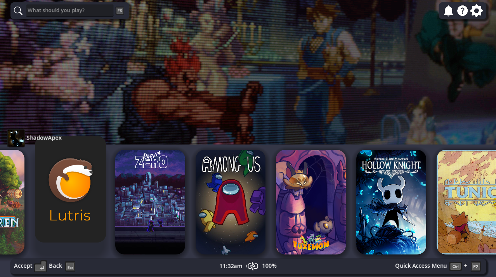

# OpenGamepadUI Discord



## Usage

You can build and install this plugin with:

```bash
make install
```

## Roadmap

[x] Show voice channel overlay
[ ] Quick access menu for managing mute/deaf
[ ] Quick access menu for changing voice channels
[ ] Option to subscribe to text channel messages
